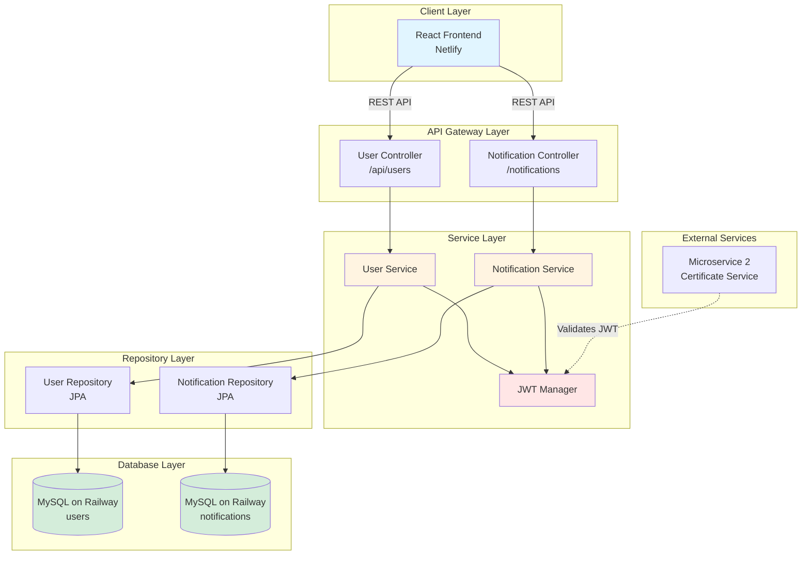
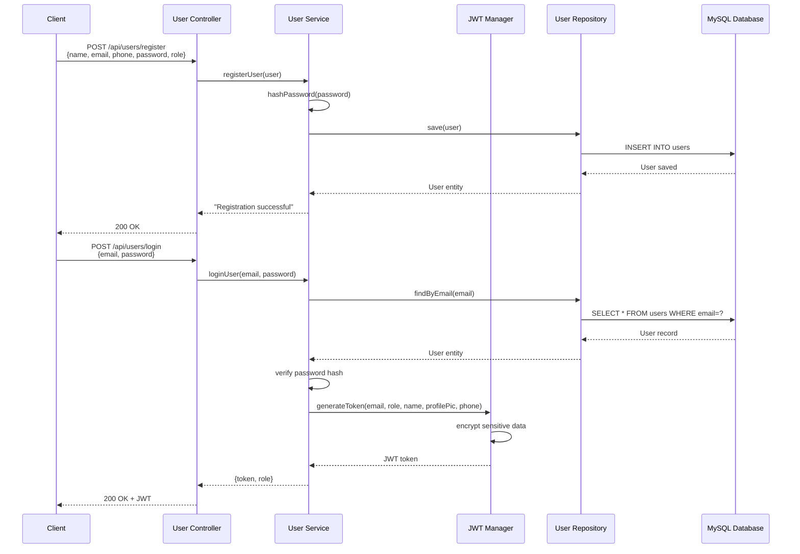
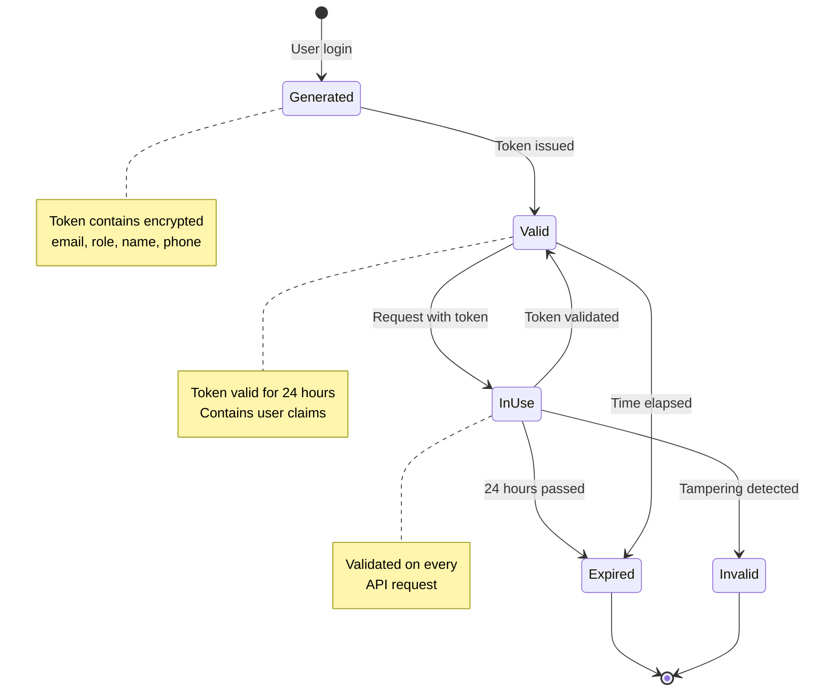
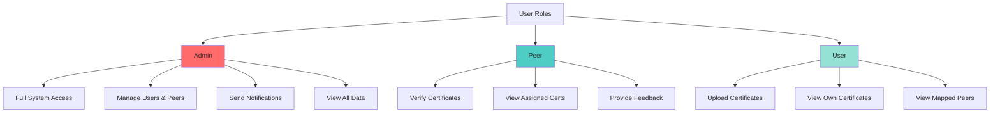
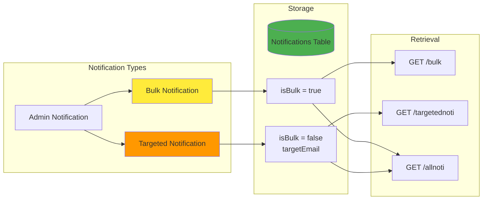
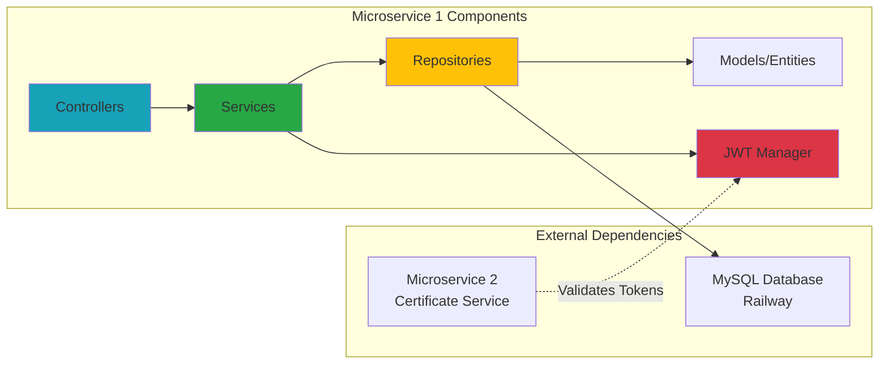

# User Management Microservice

<div align="center">
  
  **User Authentication, Authorization, and Notification Management**
  
  [](https://spring.io/projects/spring-boot)
  [](https://www.mysql.com/)
  [](https://www.oracle.com/java/)
  [](https://railway.app/)
</div>

---

## Table of Contents
- [Overview](#overview)
- [Architecture](#architecture)
- [Technology Stack](#technology-stack)
- [Features](#features)
- [Project Structure](#project-structure)
- [API Endpoints](#api-endpoints)
- [Database Schema](#database-schema)
- [Getting Started](#getting-started)
- [Configuration](#configuration)
- [Security](#security)
- [Integration](#integration)
- [Deployment](#deployment)
- [Future Enhancements](#future-enhancements)

---

## Overview

This microservice is part of the **SkillCert Certificate Tracking Platform**, serving as the central authentication and user management system. Microservice 1 handles user registration, authentication, JWT token generation, role-based access control, and notification management.

Built with Spring Boot and MySQL, this service provides RESTful APIs for user operations, secure authentication using JWT tokens with AES encryption, and a comprehensive notification system for admin-to-user communications.

**Related Repositories**:
- Frontend: [SDPFRONT](https://github.com/saimahendra282/SDPFRONT)
- Certificate Management Service: [Microservice2](https://github.com/saimahendra282/Microservice2)

---

## Architecture

### System Architecture



### Authentication Flow



### JWT Token Lifecycle



### User Role Hierarchy



### Notification System Architecture



### Component Interaction



---

## Technology Stack

### Core Framework
- **Spring Boot** 3.4.0 - Enterprise Java framework
- **Java** 17 - Programming language
- **Maven** - Dependency management and build tool

### Database and Persistence
- **MySQL** - Relational database (hosted on Railway)
- **Spring Data JPA** - ORM and data access layer
- **Hibernate** - JPA implementation
- **MySQL Connector/J** - JDBC driver

### Security
- **JJWT** (0.11.5) - JWT token generation and validation
  - jjwt-api
  - jjwt-impl
  - jjwt-jackson
- **Custom Password Hashing** - SHA-256 based password security
- **AES Encryption** - Encryption for sensitive JWT claims

### Web and API
- **Spring Boot Starter Web** - RESTful API development
- **Spring Boot Starter Validation** - Input validation
- **Spring Boot Starter Tomcat** - Embedded web server

### Development Tools
- **Spring Boot DevTools** - Hot reload and development utilities
- **Spring Boot Starter Test** - Testing framework
- **Spring Security Test** - Security testing utilities

### Cloud and Deployment
- **Spring Cloud** (2024.0.0-RC1) - Cloud-native patterns
- **Railway** - Cloud platform for deployment

---

## Features

### User Management
- User registration with role assignment (User, Peer, Admin)
- Secure password hashing using SHA-256
- User profile management (name, email, phone, profilePic, department)
- Update user and peer profiles
- Delete users and peers
- Retrieve all users by role (users, peers, admins)

### Authentication and Authorization
- User login with credential verification
- JWT token generation with 24-hour expiration
- Token validation for protected endpoints
- Encrypted sensitive data in JWT (email, phone)
- Role-based access control (RBAC)
- Profile retrieval using JWT tokens

### Role-Based Actions
- **Admin Actions**: Full system access and management
- **Peer Actions**: Certificate verification capabilities
- **User Actions**: Standard user operations
- Authorization checks for protected endpoints

### Notification System
- Create and store admin notifications
- Bulk notifications (broadcast to all users)
- Targeted notifications (specific user email)
- Retrieve bulk notifications
- Retrieve user-specific notifications
- Admin-only access to all notifications
- Timestamp tracking for all notifications

### Security Features
- Password hashing with SHA-256
- JWT token encryption with AES
- Sensitive field encryption (email, phone)
- Token expiration handling
- CORS configuration for frontend integration
- Role-based endpoint protection

---

## Project Structure

```
Microservice1/
├── src/
│   ├── main/
│   │   ├── java/
│   │   │   └── com/
│   │   │       └── micro/
│   │   │           ├── controllers/
│   │   │           │   ├── UserController.java               # User REST API endpoints
│   │   │           │   └── NotiController.java               # Notification REST API
│   │   │           │
│   │   │           ├── services/
│   │   │           │   ├── UserService.java                  # User business logic
│   │   │           │   ├── NotiService.java                  # Notification logic
│   │   │           │   └── JWTManager.java                   # JWT & encryption
│   │   │           │
│   │   │           ├── repositories/
│   │   │           │   ├── UserRepository.java               # User data access
│   │   │           │   └── NotiRepository.java               # Notification data access
│   │   │           │
│   │   │           ├── models/
│   │   │           │   ├── User.java                         # User entity
│   │   │           │   └── AdminNotification.java            # Notification entity
│   │   │           │
│   │   │           ├── config/
│   │   │           │   └── SecurityConfig.java               # Security configuration
│   │   │           │
│   │   │           ├── InkaedhefinalfixApplication.java      # Main application class
│   │   │           └── ServletInitializer.java               # Servlet configuration
│   │   │
│   │   └── resources/
│   │       ├── application.properties                        # Configuration file
│   │       └── static/                                        # Static resources
│   │
│   └── test/
│       └── java/
│           └── com/
│               └── micro/
│                   └── InkaedhefinalfixApplicationTests.java
│
├── .mvn/                                                      # Maven wrapper
├── mvnw                                                        # Maven wrapper script (Unix)
├── mvnw.cmd                                                    # Maven wrapper script (Windows)
├── pom.xml                                                     # Maven dependencies
├── .gitignore                                                  # Git ignore rules
└── README.md                                                   # Project documentation
```

---

## API Endpoints

### User Management Endpoints

#### Register User
```http
POST /api/users/register
Content-Type: application/json

Body:
{
  "name": "John Doe",
  "email": "john@example.com",
  "phone": "1234567890",
  "password": "securePassword123",
  "role": "user",
  "dept": "Engineering",
  "profilePic": "https://cloudinary.com/profile.jpg"
}

Response: "Registration successful."
```

#### Login User
```http
POST /api/users/login
Content-Type: application/json

Body:
{
  "email": "john@example.com",
  "password": "securePassword123"
}

Response:
{
  "token": "eyJhbGciOiJIUzI1NiIsInR5cCI6IkpXVCJ9...",
  "role": "user"
}
```

#### Validate Token
```http
POST /api/users/validate-token
Content-Type: application/json

Body:
{
  "token": "eyJhbGciOiJIUzI1NiIsInR5cCI6IkpXVCJ9..."
}

Response:
{
  "code": "200",
  "email": "john@example.com",
  "role": "user",
  "name": "John Doe",
  "profilePic": "https://cloudinary.com/profile.jpg",
  "phone": "1234567890"
}
```

#### Get User Profile
```http
POST /api/users/get-profile
Content-Type: application/json

Body:
{
  "token": "eyJhbGciOiJIUzI1NiIsInR5cCI6IkpXVCJ9..."
}

Response:
{
  "email": "john@example.com",
  "name": "John Doe",
  "phone": "1234567890",
  "profilePic": "https://cloudinary.com/profile.jpg",
  "role": "user",
  "dept": "Engineering"
}
```

#### Update User Profile
```http
PUT /api/users/update-profile
Content-Type: application/json

Body:
{
  "email": "john@example.com",
  "name": "John Updated",
  "phone": "9876543210",
  "profilePic": "https://cloudinary.com/new-profile.jpg",
  "dept": "Management"
}

Response: "Profile updated successfully."
```

#### Update User (Admin)
```http
PUT /api/users/update-user?email=john@example.com
Content-Type: application/json

Body:
{
  "name": "Updated Name",
  "phone": "9876543210"
}

Response:
{
  "message": "User updated successfully",
  "email": "john@example.com"
}
```

#### Update Peer (Admin)
```http
PUT /api/users/update-peer?email=peer@example.com
Content-Type: application/json

Body:
{
  "name": "Updated Peer Name",
  "dept": "Verification"
}

Response:
{
  "message": "Peer updated successfully",
  "email": "peer@example.com"
}
```

#### Delete User (Admin)
```http
DELETE /api/users/delete-user?email=john@example.com

Response: "User deleted successfully."
```

#### Delete Peer (Admin)
```http
DELETE /api/users/delete-peer?email=peer@example.com

Response: "Peer deleted successfully."
```

#### Get All Peers
```http
GET /api/users/peers

Response: 
[
  {
    "email": "peer1@example.com",
    "name": "Peer One",
    "phone": "1111111111",
    "profilePic": "url",
    "dept": "IT"
  }
]
```

#### Get All Users
```http
GET /api/users/adminusers

Response: 
[
  {
    "email": "user1@example.com",
    "name": "User One",
    "role": "user"
  }
]
```

#### Get All Admins
```http
GET /api/users/alladmins

Response: 
[
  {
    "email": "admin@example.com",
    "name": "Admin User",
    "role": "admin"
  }
]
```

### Role-Based Action Endpoints

#### Admin Action
```http
POST /api/users/admin-action
Content-Type: application/json

Body:
{
  "token": "eyJhbGciOiJIUzI1NiIsInR5cCI6IkpXVCJ9..."
}

Response: "Admin action performed successfully."
```

#### Peer Action
```http
POST /api/users/peer-action
Content-Type: application/json

Body:
{
  "token": "eyJhbGciOiJIUzI1NiIsInR5cCI6IkpXVCJ9..."
}

Response: "Peer action performed successfully."
```

#### User Action
```http
POST /api/users/user-action
Content-Type: application/json

Body:
{
  "token": "eyJhbGciOiJIUzI1NiIsInR5cCI6IkpXVCJ9..."
}

Response: "User action performed successfully."
```

### Notification Endpoints

#### Store Notification
```http
POST /notifications/store?isBulk=true
Authorization: Bearer {JWT_TOKEN}
Content-Type: application/json

Body:
{
  "title": "System Maintenance",
  "message": "Scheduled maintenance on Sunday",
  "senderEmail": "admin@example.com",
  "targetEmail": null
}

Response: "Notification stored successfully"
```

#### Get Bulk Notifications
```http
GET /notifications/bulk

Response:
[
  {
    "id": 1,
    "title": "System Update",
    "message": "New features released",
    "senderEmail": "admin@example.com",
    "targetEmail": null,
    "isBulk": true,
    "createdAt": "2026-02-12T10:30:00"
  }
]
```

#### Get Targeted Notifications
```http
GET /notifications/targetednoti?email=user@example.com

Response:
[
  {
    "id": 2,
    "title": "Certificate Approved",
    "message": "Your AWS certificate has been approved",
    "senderEmail": "admin@example.com",
    "targetEmail": "user@example.com",
    "isBulk": false,
    "createdAt": "2026-02-12T11:00:00"
  }
]
```

#### Get All Notifications (Admin Only)
```http
GET /notifications/allnoti
Authorization: Bearer {JWT_TOKEN}

Response: List of all notifications
```

---

## Database Schema

### Users Table

```sql
CREATE TABLE users (
  id BIGINT AUTO_INCREMENT PRIMARY KEY,
  name VARCHAR(255) NOT NULL,
  email VARCHAR(255) UNIQUE NOT NULL,
  phone VARCHAR(20),
  password VARCHAR(255) NOT NULL,
  role VARCHAR(50) NOT NULL,           -- 'user', 'peer', 'admin'
  dept VARCHAR(255),
  profile_pic TEXT,
  created_at TIMESTAMP DEFAULT CURRENT_TIMESTAMP,
  updated_at TIMESTAMP DEFAULT CURRENT_TIMESTAMP ON UPDATE CURRENT_TIMESTAMP
);

CREATE INDEX idx_email ON users(email);
CREATE INDEX idx_role ON users(role);
```

### Notifications Table

```sql
CREATE TABLE admin_notifications (
  id BIGINT AUTO_INCREMENT PRIMARY KEY,
  title VARCHAR(255) NOT NULL,
  message TEXT NOT NULL,
  sender_email VARCHAR(255) NOT NULL,
  target_email VARCHAR(255),           -- NULL for bulk notifications
  is_bulk BOOLEAN DEFAULT FALSE,
  created_at TIMESTAMP DEFAULT CURRENT_TIMESTAMP,
  FOREIGN KEY (sender_email) REFERENCES users(email)
);

CREATE INDEX idx_target_email ON admin_notifications(target_email);
CREATE INDEX idx_is_bulk ON admin_notifications(is_bulk);
```

### Entity Relationships

```
users (1) ----< (many) admin_notifications [sender]
users (1) ----< (many) admin_notifications [target]
```

---

## Getting Started

### Prerequisites
- **Java Development Kit (JDK) 17** or higher
- **Maven 3.6+** (or use included Maven wrapper)
- **MySQL database** (Railway or local installation)

### Installation

1. **Clone the repository**
```bash
git clone https://github.com/saimahendra282/Microservice1.git
cd Microservice1
```

2. **Configure MySQL connection**

Edit `src/main/resources/application.properties`:
```properties
spring.application.name=INKAEDHEFINALFIX
server.port=8081

# MySQL Configuration
spring.datasource.url=jdbc:mysql://hostname:port/database_name
spring.datasource.driver-class-name=com.mysql.cj.jdbc.Driver

# JPA/Hibernate Configuration
spring.jpa.hibernate.ddl-auto=update
spring.jpa.properties.hibernate.dialect=org.hibernate.dialect.MySQLDialect
spring.jpa.show-sql=true
```

3. **Build the project**

Using Maven wrapper:
```bash
# Unix/Linux/MacOS
./mvnw clean install

# Windows
mvnw.cmd clean install
```

Or using installed Maven:
```bash
mvn clean install
```

4. **Run the application**
```bash
# Using Maven wrapper
./mvnw spring-boot:run

# Using installed Maven
mvn spring-boot:run

# Or run the JAR directly
java -jar target/INKAEDHEFINALFIX-0.0.1-SNAPSHOT.jar
```

5. **Verify the application is running**
```bash
curl http://localhost:8081/api/users/adminusers
```

---

## Configuration

### Application Properties

```properties
# Application Settings
spring.application.name=INKAEDHEFINALFIX
server.port=8081

# MySQL Database Configuration
spring.datasource.url=jdbc:mysql://hostname:port/database
spring.datasource.driver-class-name=com.mysql.cj.jdbc.Driver

# Static Resources
spring.web.resources.static-locations=classpath:/static/

# JPA/Hibernate Configuration
spring.jpa.hibernate.ddl-auto=update
spring.jpa.properties.hibernate.dialect=org.hibernate.dialect.MySQLDialect
spring.jpa.show-sql=true

# Optional: Eureka Service Discovery (commented out)
# eureka.client.service-url.defaultZone=http://localhost:8761/eureka

# Optional: Email Configuration
# spring.mail.host=smtp.gmail.com
# spring.mail.port=587
# spring.mail.username=your-email@gmail.com
# spring.mail.password=your-app-password
# spring.mail.properties.mail.smtp.auth=true
# spring.mail.properties.mail.smtp.starttls.enable=true
```

### JWT Configuration

The JWT Manager uses a secret key for token signing:

```java
public final String SECRET_KEY = "YOUR_SECRET_KEY_HERE";
public final SecretKey key = Keys.hmacShaKeyFor(SECRET_KEY.getBytes());
```

**Important Security Notes**:
- Change the secret key in production
- Store secret keys in environment variables
- Never commit secrets to version control
- Use a strong, random key (at least 256 bits)

---

## Security

### Password Security

Passwords are hashed using SHA-256:

```java
private String hashPassword(String password) {
    try {
        MessageDigest digest = MessageDigest.getInstance("SHA-256");
        byte[] hash = digest.digest(password.getBytes());
        return Base64.getEncoder().encodeToString(hash);
    } catch (Exception e) {
        throw new RuntimeException("Error hashing password", e);
    }
}
```

### JWT Token Structure

Tokens contain encrypted user information:

```json
{
  "email": "encrypted_email_data",
  "role": "user",
  "name": "John Doe",
  "profilePic": "https://cloudinary.com/profile.jpg",
  "phone": "encrypted_phone_data",
  "iat": 1707732000,
  "exp": 1707818400
}
```

### AES Encryption

Sensitive fields are encrypted using AES:

```java
private String encryptData(String data) {
    // AES encryption implementation
    Cipher cipher = Cipher.getInstance("AES");
    cipher.init(Cipher.ENCRYPT_MODE, secretKey);
    byte[] encryptedBytes = cipher.doFinal(data.getBytes());
    return Base64.getEncoder().encodeToString(encryptedBytes);
}

private String decryptData(String encryptedData) {
    // AES decryption implementation
    Cipher cipher = Cipher.getInstance("AES");
    cipher.init(Cipher.DECRYPT_MODE, secretKey);
    byte[] decryptedBytes = cipher.doFinal(Base64.getDecoder().decode(encryptedData));
    return new String(decryptedBytes);
}
```

### Role-Based Access Control

Endpoints are protected by role validation:

```java
public boolean hasRole(String requiredRole, String token) {
    Map<String, String> claims = jwtManager.validateToken(token);
    String userRole = claims.get("role");
    return requiredRole.equals(userRole);
}
```

---

## Integration

### Integration with Microservice 2

Microservice 2 validates JWT tokens from this service:

**Token Generation (MS1)**:
```java
String token = jwtManager.generateToken(email, role, name, profilePic, phone);
```

**Token Validation (MS2)**:
```java
String email = jwtManager.extractEmailFromToken(token);
```

### Integration with Frontend

The frontend stores and uses JWT tokens:

```javascript
// Login and store token
const login = async (email, password) => {
  const response = await axios.post(
    'https://microservice1-production.up.railway.app/api/users/login',
    { email, password }
  );
  
  localStorage.setItem('jwtToken', response.data.token);
  localStorage.setItem('userRole', response.data.role);
};

// Use token in requests
const getProfile = async () => {
  const token = localStorage.getItem('jwtToken');
  
  const response = await axios.post(
    'https://microservice1-production.up.railway.app/api/users/get-profile',
    { token }
  );
  
  return response.data;
};
```

---

## Deployment

### Railway Deployment

1. **Connect GitHub repository to Railway**

2. **Set environment variables**
```bash
SPRING_DATASOURCE_URL=jdbc:mysql://railway-host:port/database
SERVER_PORT=8081
JWT_SECRET_KEY=your_production_secret_key
```

3. **Configure build settings**
```
Build Command: ./mvnw clean package -DskipTests
Start Command: java -jar target/INKAEDHEFINALFIX-0.0.1-SNAPSHOT.jar
```

4. **Database Setup**
Railway automatically provisions MySQL instances. Configure the connection URL in environment variables.

### Docker Deployment (Planned)

Create `Dockerfile`:
```dockerfile
FROM openjdk:17-jdk-slim
WORKDIR /app
COPY target/INKAEDHEFINALFIX-0.0.1-SNAPSHOT.jar app.jar
EXPOSE 8081
ENTRYPOINT ["java", "-jar", "app.jar"]
```

Build and run:
```bash
docker build -t microservice1 .
docker run -p 8081:8081 \
  -e SPRING_DATASOURCE_URL="jdbc:mysql://..." \
  -e JWT_SECRET_KEY="..." \
  microservice1
```

---

## Future Enhancements

### Technical Improvements
- Implement Docker containerization
- Add comprehensive unit and integration tests
- Implement Redis caching for user sessions
- Add request rate limiting per user
- Implement database connection pooling
- Add health check and metrics endpoints (Actuator)
- Implement database migrations with Flyway/Liquibase

### Feature Additions
- Email verification during registration
- Password reset functionality
- Two-factor authentication (2FA)
- User profile picture upload to Cloudinary
- Activity logging and audit trails
- User session management
- Refresh token mechanism
- Social authentication (Google, GitHub)

### Security Enhancements
- Implement bcrypt for password hashing
- Add OAuth2 authentication
- Implement CSRF protection
- Add API key management
- Implement field-level encryption for PII
- Add brute-force protection
- Implement HTTPS/TLS certificate pinning

### Notification System Enhancements
- Email notifications via SMTP
- Push notifications
- Notification preferences per user
- Notification read/unread status
- Notification categories and filtering

---

## API Testing

### Using cURL

**Register User**:
```bash
curl -X POST http://localhost:8081/api/users/register \
  -H "Content-Type: application/json" \
  -d '{
    "name": "John Doe",
    "email": "john@example.com",
    "phone": "1234567890",
    "password": "SecurePass123",
    "role": "user",
    "dept": "Engineering"
  }'
```

**Login User**:
```bash
curl -X POST http://localhost:8081/api/users/login \
  -H "Content-Type: application/json" \
  -d '{
    "email": "john@example.com",
    "password": "SecurePass123"
  }'
```

**Get User Profile**:
```bash
curl -X POST http://localhost:8081/api/users/get-profile \
  -H "Content-Type: application/json" \
  -d '{
    "token": "YOUR_JWT_TOKEN_HERE"
  }'
```

### Using Postman

1. Import API collection
2. Set environment variables:
   - `BASE_URL`: `http://localhost:8081`
   - `JWT_TOKEN`: Your generated token
3. Execute requests

---

## Troubleshooting

### Common Issues

**Issue**: Cannot connect to MySQL database
```
Solution: Verify database credentials and network connectivity
Check: spring.datasource.url in application.properties
Verify: MySQL service is running
```

**Issue**: JWT token validation fails
```
Solution: Ensure token is not expired (24-hour validity)
Check: Secret key matches across services
Verify: Token format is correct (Bearer prefix)
```

**Issue**: "Access denied" errors
```
Solution: Verify user role matches endpoint requirements
Check: Token contains correct role claim
Verify: Role-based access control logic
```

**Issue**: Password hash mismatch during login
```
Solution: Ensure consistent hashing algorithm
Check: Password is being hashed on registration
Verify: Hash comparison logic in login
```


---

<div align="center">
  <p>Part of the SkillCert Certificate Tracking Platform</p>
  <p><strong>Microservice 1</strong> - User Management and Authentication</p>
</div>
